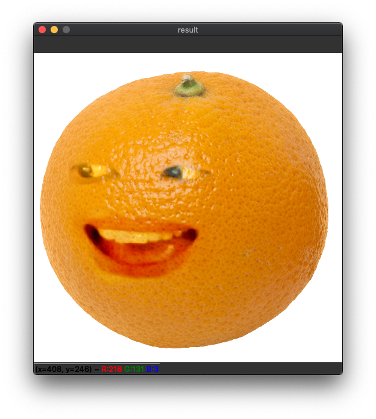
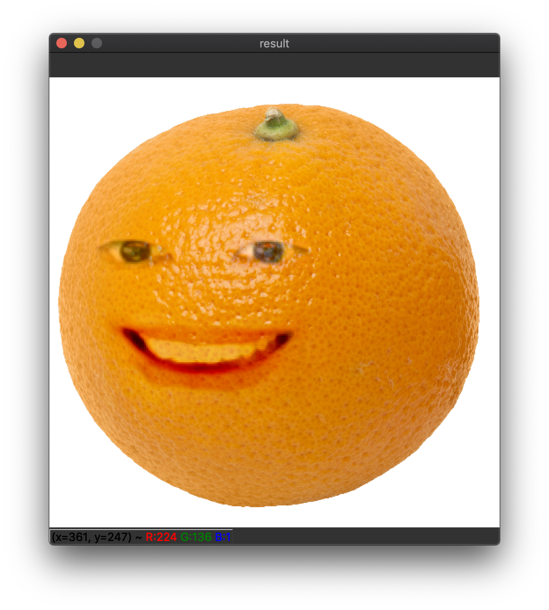

# Annoying Orange with My Face

[Demo video](https://youtu.be/9VYUXchrMcM)

Composite orange image and my face image using [Poisson blending (Seamless clone)](https://docs.opencv.org/master/df/da0/group__photo__clone.html#ga2bf426e4c93a6b1f21705513dfeca49d) using OpenCV Python.

|   |   |
|---|---|
|  |  |

## Dependency
- Python 3
- OpenCV 4+
- Dlib
- imutils
- numpy

## [68 face 다운로드 링크](https://github.com/davisking/dlib-models/blob/master/shape_predictor_68_face_landmarks.dat.bz2) 
 - 압축푸는 명령어 : bunzip2 shape_predictor_68_face_landmarks.dat.bz2

## [샘플영상 다운로드링크](https://www.pexels.com/video/food-woman-creative-table-3992591/)